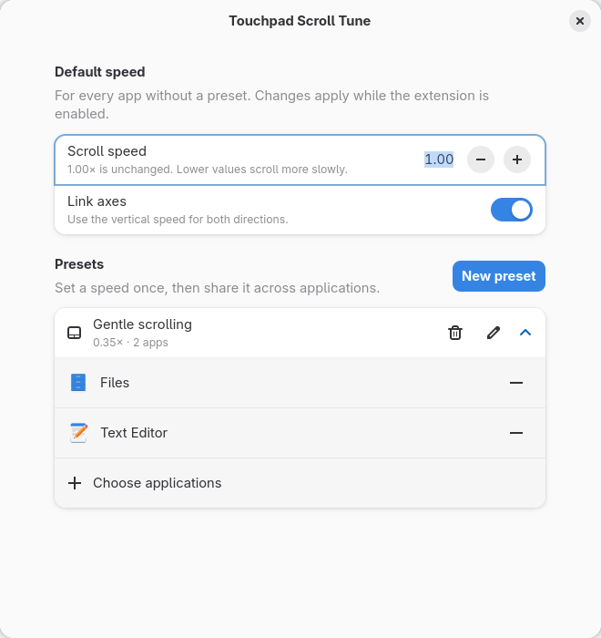

# Touchpad Scroll Tune

Set a comfortable touchpad scroll speed for each application on **GNOME 51 / Wayland**.
Create a preset once and share it across apps — for example, slow down scrolling
in Electron apps while keeping your usual speed elsewhere.

**Requires [Wayland Scroll Factor (WSF) 1.0 or later](https://github.com/daniel-g-carrasco/wayland-scroll-factor),
installed and enabled separately. Installing this extension does not install WSF.**



The screenshot shows example settings: a 0.35× preset shared by Files and Text Editor.
The extension does not create example presets on first launch.

## Features

- Reusable presets with application selection in native GTK/libadwaita preferences.
- Separate vertical and horizontal factors, or linked axes.
- Speeds follow the window under the pointer, including unfocused windows.
- Event-driven window tracking: no periodic cursor polling or pointer-motion handler.
- Native `wsf set` commands, with asynchronous completion and no persistent helper.
- Original scroll speeds are restored when the extension is disabled.
- Pinch zoom and rotation settings are preserved.

## Requirements

| Component | Requirement |
| --- | --- |
| Desktop | **GNOME Shell 51 only**; other versions are not currently supported |
| Session | **Wayland** |
| Scroll backend | **Wayland Scroll Factor 1.0+**, with its backend active in GNOME Shell |
| Runtime | GJS, GTK 4 and libadwaita, normally provided by GNOME |

This is a GNOME Shell extension; it does not support KDE, other compositors or X11.
Node.js is used for development tests only.

### Install and enable WSF first

1. Follow the upstream [WSF installation instructions](https://github.com/daniel-g-carrasco/wayland-scroll-factor#install)
   for your distribution.
2. Enable its GNOME backend:

   ```sh
   wsf enable
   ```

3. **Log out and log back in.**
4. Check the installation:

   ```sh
   wsf --version
   wsf status
   ```

Use WSF 1.0 or later. The status should report `gnome-shell library mapped: yes`.
The extension needs the `wsf` executable in `PATH` or at `~/.local/bin/wsf`.
See [upstream troubleshooting](https://github.com/daniel-g-carrasco/wayland-scroll-factor/blob/main/docs/troubleshooting.md)
if the backend is not active.

## Install the extension

Until a GNOME Extensions listing is available, install from this repository:

```sh
git clone https://github.com/pylame22/touchpad_scroll_tune.git
cd touchpad_scroll_tune
sh scripts/package.sh
gnome-extensions install dist/touchpad-scroll-tune@pylame22.shell-extension.zip
```

Log out and log back in so GNOME Shell discovers the extension, then run:

```sh
gnome-extensions enable touchpad-scroll-tune@pylame22
gnome-extensions prefs touchpad-scroll-tune@pylame22
```

Disable other extensions that change WSF scroll factors before enabling this one.
On first launch, **Default** captures the current WSF factors, which may still be
the last app's override from a previously used extension.

To update an existing installation, rebuild the archive and install it with
`gnome-extensions install --force dist/touchpad-scroll-tune@pylame22.shell-extension.zip`,
then log out and back in to load the updated code.

## Use

1. Open the preferences and adjust **Default speed** for apps without an assignment.
2. Click **New preset**, give it a name and choose its speed.
3. Expand the preset, click **Choose applications**, select apps and click **Apply**.

`1.00×` leaves the scroll amount unchanged. Lower factors scroll more slowly;
higher factors scroll faster. Supported values are 0.05×–5.00×.
Turn off **Link axes** to adjust vertical and horizontal scrolling separately.

An application belongs to at most one preset. Renaming a preset keeps its
assignments. Removing a preset returns its applications to Default.
Default speed saves automatically; preset dialogs save when you click **Create**
or **Save**. Default also applies to Shell UI and the overview.

The extension captures WSF's current speeds each time it is enabled. Disabling it
restores those speeds asynchronously after any in-flight command finishes. If the
configuration cannot be restored, the error is logged in the user journal.
Restoration requires GNOME Shell to keep running until the final command completes;
it is not guaranteed after a Shell crash or forced termination.

## Troubleshooting and reporting bugs

- **“WSF is not active”**: run `wsf enable`, log out and back in, then check `wsf status`.
- **WSF is missing or its output is unsupported**: install or upgrade to WSF 1.0+.
- **Speeds keep changing unexpectedly**: check for another extension or WSF tool
  writing scroll factors at the same time.
- **An app uses Default**: check its preset assignment; applications GNOME cannot
  identify use Default.
- **Updated code is not taking effect**: start a new GNOME session after installing
  an update. Disabling and re-enabling alone does not reload Shell JavaScript.

Report problems in [GitHub Issues](https://github.com/pylame22/touchpad_scroll_tune/issues).
Include your distribution, GNOME Shell version, WSF version, affected application
and steps to reproduce. Relevant logs can be found with:

```sh
journalctl --user -b -g 'Touchpad Scroll Tune'
```

## Development

The code is plain GJS; no npm packages or build framework are required.
For a development installation, compile the schema and symlink this directory
into `~/.local/share/gnome-shell/extensions/touchpad-scroll-tune@pylame22`.
Use a separate headless/nested GNOME Shell with isolated settings and a fake WSF
command when testing, so experiments do not change your desktop's scrolling.

### Checks

```sh
node --test tests/*.mjs
glib-compile-schemas --strict --dry-run schemas
```

All tests run through Node.js 24+ using its built-in test runner; no npm packages
are needed. Integration tests also require `gjs`. They use a fake `wsf` command
written in JavaScript with temporary state, so they never change the real WSF
configuration. GJS fixtures exercise real asynchronous subprocesses and the
extension lifecycle with Shell imports stubbed. Tests cover command arguments,
command failures, startup cancellation, restoration and rapid disable/re-enable.

The packaged extension has also been checked in an isolated GNOME Shell 51.0
Wayland session with a fake WSF: actor tracking, signal and idle-source cleanup,
restoration of both axes and immediate re-enable with the correct baseline.

Before publishing, also check the installed ZIP in GNOME 51: pointer crossings,
window movement under a stationary pointer, changing presets, opening preferences,
screen lock/unlock and disabling the extension during a speed change.

### Packaging

```sh
sh scripts/package.sh
```

The ZIP in `dist/` includes the runtime modules, schema XML and license. Tests,
screenshots and development scripts stay in the repository. This is the archive
to submit through [GNOME Extensions](https://extensions.gnome.org/upload/).
An upload is subject to GNOME's extension review.

### Implementation

One GSettings string stores validated JSON: `presets` maps stable IDs to names and
two factors; `assignments` maps desktop IDs to preset IDs. `default` is reserved.

The extension observes `notify::has-pointer` on the window actor tree, including
new subsurfaces, and coalesces crossing/window events into one idle callback.
Tracking disconnects entirely when no assigned application differs from Default.

Startup uses `wsf status --json` to check the backend and read the current factors.
The status command has a five-second timeout and is cancelled, along with its
timeout, if the extension is disabled.

Speed changes run `wsf set --scroll-vertical VALUE --scroll-horizontal VALUE`
and await completion asynchronously. WSF handles its own configuration file;
the extension does not read or edit it. Only scroll factors are passed to WSF,
leaving pinch zoom and rotation settings unchanged.

One speed command runs at a time, retaining only the latest requested speed and
skipping unchanged factors. Speed commands have no timeout or cancellation so
they can finish in order, including restoration after disable. A stuck `wsf set`
would delay subsequent changes and restoration until that process exits.
On disable, Shell disconnects its signals and removes its idle source; the writer finishes
its current operation and restores the original factors without accessing Shell
UI. Re-enabling waits asynchronously for this final command before reading a new
baseline. The temporary restoration promise is cleared when it finishes.

## License

[MIT](LICENSE). Scroll adjustment is provided by the separately installed
[Wayland Scroll Factor](https://github.com/daniel-g-carrasco/wayland-scroll-factor) project.
